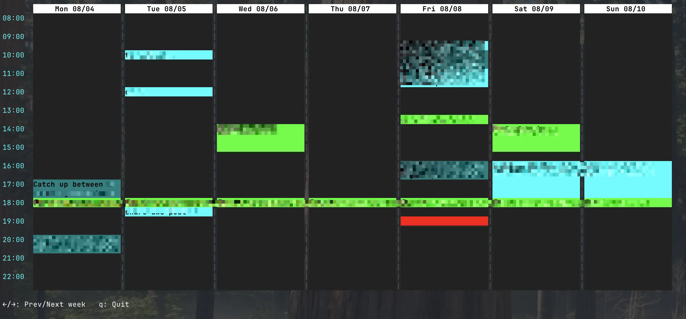

# gcal-tui

Because I want a quick way to check today's events, or see my week's schedule.

`iCalBuddy` is great, but then I don't use Apple Calendar. Also I use linux half the time.

I found `Calcure` but I want a week-view.

So here we are. Plus I use multiple calendars, so there's that.

## Notes

Don't forget to unquote `authorization code` obtained from the redirected URL

```python
from urllib.parse import unquote
unquote("AUTHORIZATION_CODE")
```


## Pre-reqs

Create `Oauth Client ID` with scope `calendar.events`.

Then create a config at `~/.config/gcal-tui/config.yaml`

```yaml
accounts:
    - name: personal
      credentials: ~/.config/gcal-tui/foo.json
      calendars:
        - id: primary
          color: aqua
        - id: xxxxxxxx@group.calendar.google.com
          color: green
    - name: alternate
      credentials: ~/.config/gcal-tui/bar.json
      calendars:
        - id: primary
          color: teal
```

But you should add one account at a time. I still haven't added `init` command to init access token request for each account.

## Screenshot


